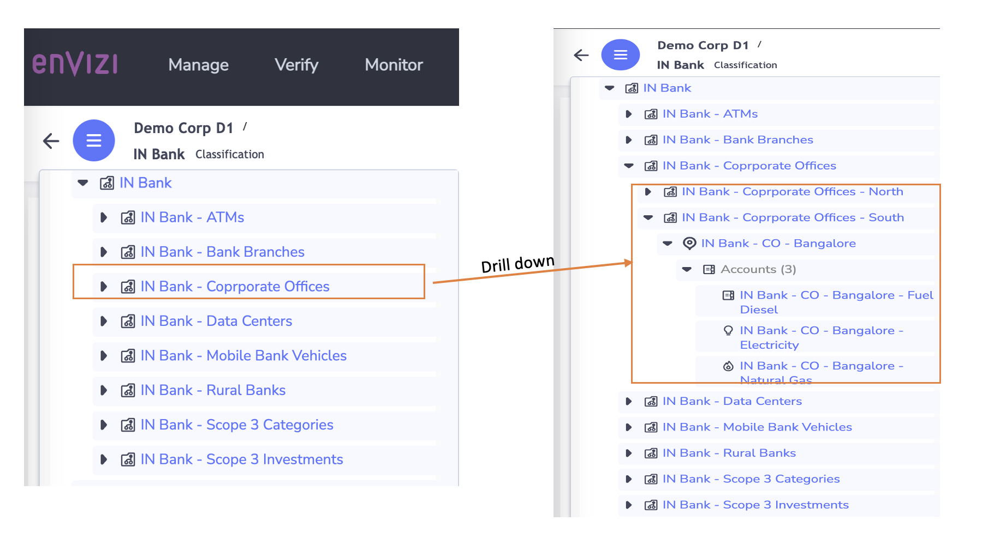

# Understand the importance of sustainability data hierarchy from Industry point of view

#### Authors
 [Indira Kalagara](https://community.ibm.com/community/user/envirintel/people/indira-kumari-kalagara1), [Jeya Gandhi Rajan M](https://community.ibm.com/community/user/envirintel/people/jeya-gandhi-rajan-m1), [Mamatha Venkatesh](https://community.ibm.com/community/user/envirintel/network/members/profile?UserKey=813a3553-d5cc-4b76-9970-ed40f865cb31)

## Objective
The objective of this article is to help understand the importance of organizing the sustainability data. 

## Why Organizing data is important in Sustainability journey ?

To meet with the net-zero goals the first step for the organizations after identifying the material boundaries is, to collect the data for Scope1 , 2 and 3 emissions. The organization may have their operations spanned across various locations / regions /  business units , departments, manufacturing sites, suppliers, subsidiaries, etc.   So, It is important for organization to collect the data across all these operations  and ensure that at any point of time,  there should be a complete visibility of data. 

For example, the Organization should be able to view data at various levels 
- at the entire organization level   
- at a particular business unit / location / site
- at particular meter ( like electricity, water, etc)   / asset level 
- which location / business unit is performing better or worst, etc
- and quickly understand whether they are in-line with their net-zero goals

And to achieve the same, it is crucial that the data has to be organized in a fashion such that at any point of time, the organization should be able to navigate easily, view the performance at various levels and  get insights. By having a structured approach, the organization should be able to streamline their data which help accelerate their sustaibability reporting as well as decarbonization journey.

## How Envizi Organizes the data ?

IBM Envizi  represents the data in hierarchical fashion with the flexibility given to the organization  to create their own organizational hierarchy.  By creating the  Organization Hierarchy, one should be able to navigate through
- groups (ex: business unit/ branches, etc),
- locations( ex: particular geo graphical location ), 
- accounts and meters (ex: electricity / water/ gas consumption , utility meter, etc)

## Create  Organization Hierarchy

To begin with, as part of the Envizi scoping exercise, you must have identified the set of locations, accounts , meters from which the data has to be captured

Now lets look at the different industries and the kind of data that is important to collect and how it can be organized. Lets walk through couple of sectors - financial services and telecommunications.

### Organize Sustainability data for a Bank:

First lets take an example from Financial Services Sector.  For example, let’s consider a Bank which is on path of Sustainability Journey.

To start with,  lets say that the Bank identifies its groups of various operations and business units from which the data related to sustaibility parameters ( emissions /consumptions ) needs to be captured.  Lets look into bit more details on the banking operations. 

Typically, Bank has their corporate offices where the core financial decisions takes place , and also  operates multiple branches and ATMs to provide services to the customers. Through the Rural Banking and Mobile Banking services, the banks also offers services to the far end customers in rural areas and small towns , etc. 

While running these operations successfully, Bank would be typically consuming various resources like Electricity to operate their branches, atms, offices, etc,  and  consume diesel, and gas to operate their vehicles, generators, etc.   So, all these resource consumptions lead to emissions which bank need to track and control. 

Similarly, Bank operations involve lot of paper work, for which the paper and stationary will be procured from the  `suppliers / vendors`.  Likewise, bank may be utilizing courier services like FedEx, etc to distribute the debit / credit cards, etc.  These products and services which are utilized by bank in day to day operations contribute towards their indirect emissions, which bank need to report.  

Along with this, bank’s applications and digital services are deployed , either on their own on-premise Data centers or cloud services.

The other aspect when it comes to financial services  is, the responsibility towards the emissions contributed through their investments. So Banks has to  capture the emissions coming out of their investments / loans and need to take accountability and report. 

These are some of the data points to give an high level view, however there may many more such data points which the bank may identify or need to report as part of the Sustianbility reporting. 

Considering all these aspects of the Banking operations, lets derive the high level hierarchy. The hierarchy  is basically logical grouping of various operations  which are associated with physical / virtual locations where the data should be captured.  

Here is one of the representation of the High level Hierarchy considering various banking operations discussed above and corresponding data types  to capture from the same. However there may be many other metrics and parameters  including social / governance etc ,  which needs to be considered in the whole sustainable journey. 

 

This highlevel hierarchy is represented in Envizi as you see in the below screen

### Organize Sustainability data for a Telecommunication Company:

Now, lets look at a Telecommunication company which spanned across different parts of world and offers various services like broadband, mobile internet services, telephony services, multi-media services, etc. The company needs to run large infrastructure to offer all these serviecs which involves, cell towers, network sites, base stations as well as corporate offices, data centers, media houses, customer care centers, retail stores etc.  All these operations consume lot of resources like electricity, natural gas, water, etc, and contribute to significant green-house gases / emissions, which has to be captured as part of the sustainability data capture. 

As we all enjoy the last mile connectivity,  it is important for the telecommunication serviecs to run their operations in remote areas, hill stations etc.  These place may have challenges with power supplies for which the company generally depends on alternate sources of power like solar energy or diesel generators, etc. Here, the emissions which are coming from the sources by combusting the fules and the energy produced / consumed from the alternative sources need to be captured. Also,the company may alredy be started using reneweable energies in most of their operations either sourcing directly from the reneweable energy plants or having  Power purchased agreements (PPAs)  with the suppliers or  puchasing Renewable Energy Certificates (RECs).  These PPAs, RECs should be captured which influences the companies overall emissions as well as ESG reporting.

Here, the emissions which are coming from the sources by combusting the fules need to be captured.  But the renewable energy sources like solar power plant may not be generating emissions, however it is important to capture the energy produced and cosumed from these sources which needs to be . 

When it comes to overall emissions from the Telecom company, the major contributor is their Scope 3 emissions, which are coming from their supply chain. Again the major part of these emissions are coming from the goods / services purchased by the company. For example, the company needs to purchase lot of Radio network equipments, modems, routers, switches, computers, telephony equipments, cables, fiber optics, multiplexers, satellite devices, computers, many more. If the products are supplied with Product Carbon Footprint (PCF) then it would be easier for the company to capture the emissions. If not, the company need to work with the  corresponding suppliers and capture the the emissions and also influence them towards the net-zero journey.

The company may also be having thier own retail operations to sell modems / mobiles, etc. The emissions / energy consumptions from the the usage of these sold products has to be captured as part of the the Scope 3 emissions.

Also, generally it is common for telecom companies to run some of their in the assets which are leased, like sites to operate cell towers, building to run their operations etc. So the emissions coming from these leased assets has to be captured which repesent  the indirect emissions of the company.

And, most of the telecom opertions are infrastructure oriented, so there would be lot of waste generated at their sites. The company either processes the waste ( like modems/ routers to reuse ) or send to landfill. So all these operations related to waste processing / generation etc needs to be captured to estimate the emissions contributed. 

Apart from this, there are other social and governance related data like community investments, employee saftey metrics, diveristy in management boards, etc.  To get the single and consolidate view of the data , these data points should be pulled from the existing enterprise systems to Envizi data foundation, Ewhich helps with the overall Sustainiability reporting.

### Next Steps:
Now  we have seen high level representation of the example  hierarchies for the copule of industries,  and identified corresponding data  to be captured, next is to bring up this hierarchy in the Envizi, load the data and get insights. The articles listed in the appendix section provide you instructions on how to achieve the same in Envizi. 

## Appendix:
You can also refer the following articles

[Create Org Hierarchy and load data in Envizi via UI](https://community.ibm.com/community/user/envirintel/blogs/jeya-gandhi-rajan-m1/2023/04/04/create-orghierarchy-and-load-data-in-envizi-via-ui)
