# Organizing Bank's Sustainability data using IBM Envizi

This blog explains about how to leverage IBM Envizi in the context of banking industry. 

#### Authors
 [Jeya Gandhi Rajan M](https://community.ibm.com/community/user/envirintel/people/jeya-gandhi-rajan-m1), [Indira Kalagara](https://community.ibm.com/community/user/envirintel/people/indira-kumari-kalagara1), [Mamatha Venkatesh](https://community.ibm.com/community/user/envirintel/network/members/profile?UserKey=813a3553-d5cc-4b76-9970-ed40f865cb31)

## 1. Objective

The objective of this article is to showcase how the sustainability data of Bank can be organized in IBM Enviz and gain insights at various levels.  
Assuming that we have an understanding of the Organization Hierarchy and defined a view like the one represented in the below screenshot. 

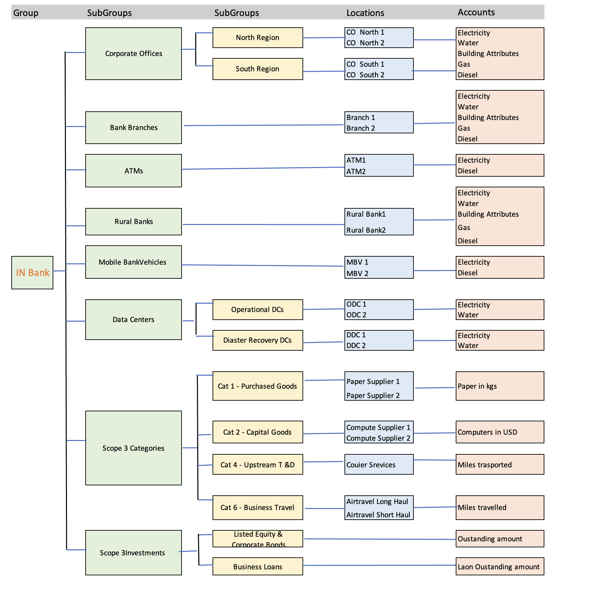

Now, Lets start realizing the hierarchy for the bank in IBM Envizi.

We can create the hierarchy through template and UI. For UI approach you can refer the article here. In this article  we will take the Template approach. 

Following the hierarchy diagram, we will list down the sequence of steps to be followed.

1.	Create Groups/Subgroups
2.	Create Locations 
3.	Create Accounts
4.	Navigate through Bank's Hierarchy in IBM Envizi 
5.	Load data into the accounts 
6.	View data and gain insights from Envizi UI + dashboards

In this exercise, let’s call our Bank as - ‘IN Bank’ and use the same name as a prefix for all subgroups, locations, accounts, etc. 

## 1. Create Groups / Subgroups

Let’s create groups which are identified in our Bank hierarchy. 

### a. Prepare Groups 
1. Update the Groups template as shown below by adding the values in corresponding columns.  
&nbsp;&nbsp; Action: *Create* 
&nbsp;&nbsp; Group Type: *Classification* 
&nbsp;&nbsp; Belongs To: *DemoCropD1* 
&nbsp;&nbsp; Group Name: [Provide name for the Parent group] ex: *IN Bank*

2. Save this file with the below naming conventions  
    Sheet / tab name: *Setup* 
    File name : *Envizi_SetupGroups_xxxxxxx* 
    Ex: Envizi_SetupGroups_INBank

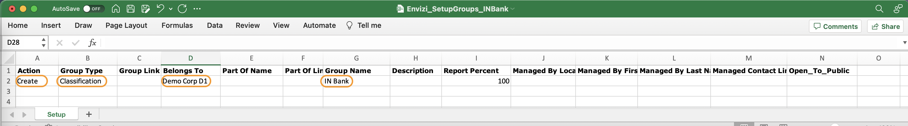

 

### b. Prepare Subgroups

As per our Bank hierarchy, we have identified 2 levels of subgroups. 

1. Lets create the 1st level subgroups by updating values in the required columns using the same groups template
 
&nbsp;&nbsp; Action: *Create* 
&nbsp;&nbsp; Group Type: *Classification* 
&nbsp;&nbsp; Belongs To: *DemoCropD1*  
&nbsp;&nbsp; Part of Name: [Name of the Parent group] ex: *IN Bank* 
&nbsp;&nbsp; Group Name: [Provide name for the Subgroup]  

2. Save this file with the below naming conventions 
    Sheet / tab name: *Setup*   
    File name: *Envizi_SetupGroups_xxxxxxx*   
    Ex : Envizi_SetupGroups_Sub_INBank

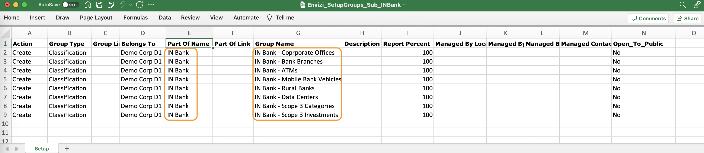

3. Similarly, create the 2nd level subgroups identified in the Bank hierarchy. Keeping the rest of the values same, update the sheet for the columns *Part of Name* and *Group Name* relevant for the subgroups.

4. Save this file with the below naming conventions  
    Sheet / tab name: *Setup*  
    File name is *Envizi_SetupGroups_xxxxxxx* 
    Ex: Envizi_SetupGroups_Sub_Sub_INBank

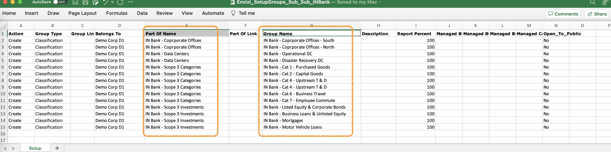
 

### c. Upload 

Upload the excel files prepared above from  Envizi UI

1. Navigate to  *Manage -> Upload Files*
   
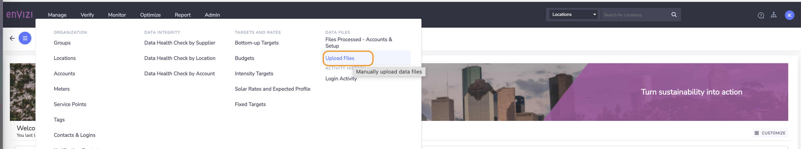

2. *Files Uploaded page -> Create New -> Select the File*.  Good to provide Name as it would help to search in Files Processed page to check the status / any errors.

3. Once Uploaded, navigate to *Manage -> Files Processed* to check the status of the file.   
   In case the File Status is Error, then please check the *Load / Parse errors*, resolve the same and upload the file again.  
   To check errors, select the file -> Actions button -> Show Load errors / Parse errors.

4. Follow the upload procedure from c.1 - c.3  for all the Groups / 1st level and 2nd level subgroups. 
   
5. Once created, verify the groups from *Manage -> Groups. *

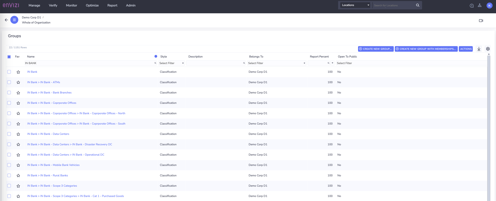
 

## 2. Create Locations

Let’s create locations from where the actual data is going to be captured. For example, locations where the ATMs, branches or corporate offices located for the Bank.  

1. Update the location template with the values in corresponding columns.   
&nbsp;&nbsp; Action: *Create* 
&nbsp;&nbsp; Associate: *Demo Corp D1* 
&nbsp;&nbsp; Location Type: [*Type of the location ex: ATM, Bank, Offices, Other etc*] 
&nbsp;&nbsp; Location Name: [*Provide name for the location*] 
&nbsp;&nbsp; Country: [*Country of the given location*] 
&nbsp;&nbsp; Region: [*state / province / region*] 
&nbsp;&nbsp; Group Name: [*Name of the group created above to which this location should be associated with*] 
&nbsp;&nbsp; Group Associate: *Demo Corp D*1 

2. Save this file with the below naming conventions  
Sheet / tab name: *Setup*  
File name: *Envizi_ SetupLocations_xxxxxxx* 
Ex: Envizi_SetupLocations_INBank.xlsx

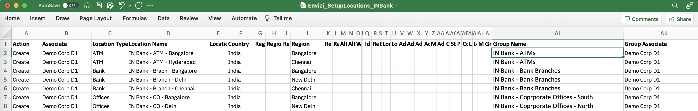

3. Upload the file by following the steps from [1.c](#c.upload )  
Once uploaded, verify the locations created in Envizi UI -> Manage -> Locations. 

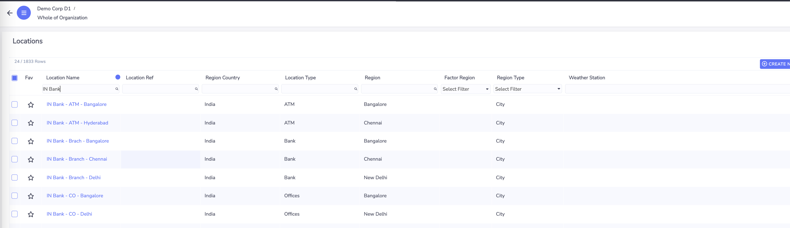

 

## 3. Create Accounts

Now we have all the groups representing branches / atms / offices created and associated the same with their physial locations, the next step is to create the account. Accounts are used in Envizi to capture, store and report data. So  the account should be created for each of the data type that needs to be captured from banking perspective.  
 Lets have a look at the hierarchy diagram, which represents what needs to be captured from each location / site. This is just an example set of data just to give an understanding. 

1. Before looking at the Account template, the important step is to identifying the corresponding Accoutn styles for each of the data types. To check on the available Account Styles, extract the Account Style Extract Report from Envizi -> Reports 

2. Update the Accounts template: 
&nbsp;&nbsp; Action: Create  
&nbsp;&nbsp; Associate: Demo Corp D1  
&nbsp;&nbsp; Location Name: [Name of the location to associate the account with] 
&nbsp;&nbsp; Account Style: [Provide the Account style related to the data type to be captured] 
&nbsp;&nbsp; Account Number: [Provide a unique name] 

3. Save this file with the below naming conventions  
Sheet / tab name: *Setup* 
File name: *Envizi_ SetupAccounts_xxxxxxx* 
Ex: Envizi_SetupAccounts_INBank.xlsx

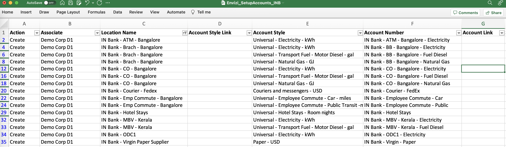

4. Upload the file by following the steps from [1.c](#c.upload )

5. Verify the accounts created in Envizi. *Manage -> Accounts*

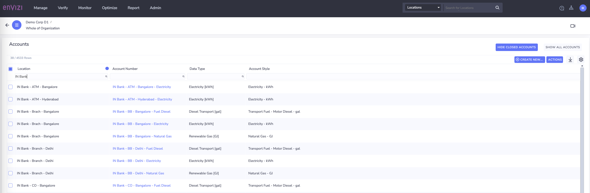

 

## 4. Navigate through Bank's Hierarchy in IBM Envizi 
To view the entire hierarchy created through the above steps, navigate to *Envizi UI -> Demo Corp D1 -> Classification groups -> IN Bank* 

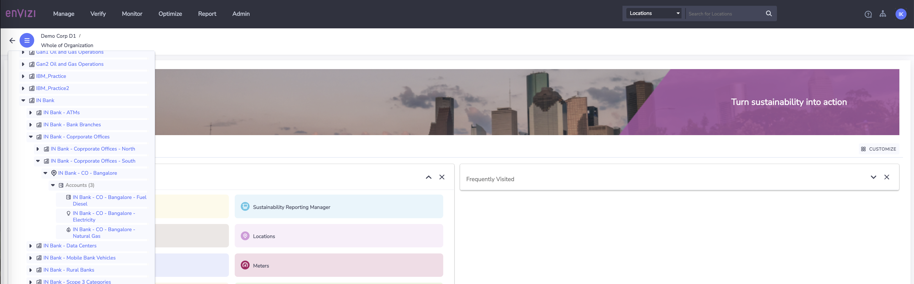
 

## 5. Load data into the accounts 

Now that we have the sample organization hierarchy created for an example Bank called ***IN Bank***, lets also look at how to capture the data using bulk load approach via template. 

1. Update the Records template:  
&nbsp;&nbsp; Oganization: *Demo Corp D1* 
&nbsp;&nbsp; Location: [*Name of the location to associate the account with*] 
&nbsp;&nbsp; Account Style Caption : [*Account style associated with the account to which the data is being loaded *]  
&nbsp;&nbsp; Account Number: [*Provide Account number*] 
&nbsp;&nbsp; Date Format : *YYYY-MM-DD* 
&nbsp;&nbsp; Start Date: [*Provide Start date of the data*] 
&nbsp;&nbsp; End Date: [*Provide End date of the data*] 
&nbsp;&nbsp; Qunatity: [*Provide the value based on the units defined for the data type*]  
&nbsp;&nbsp; Total Cost: [*Optional*] 

2. Save this file with the below naming conventions  
Sheet / tab name: *Records to load* 
File name is *Envizi_Universal_Data_xxxx*  
Ex: Envizi_Universal_Data_INBank.xlsx

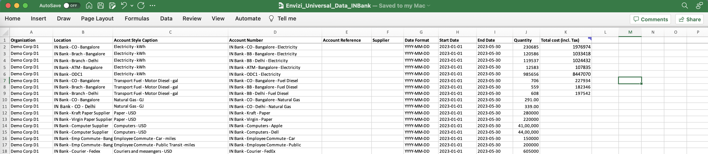

3. Upload the file by following the steps from [1.c](#c.upload )

## 6. View data and gain insights from Envizi UI + dashboards

As we have uploaded the data successfully to the accounts, lets look at the same from Envizi UI.
 

1. View data from account    
*Navigate to Manage -> Accounts -> Select an Account -> Click on Account number *

Here is an example screenshot of Account Summary page
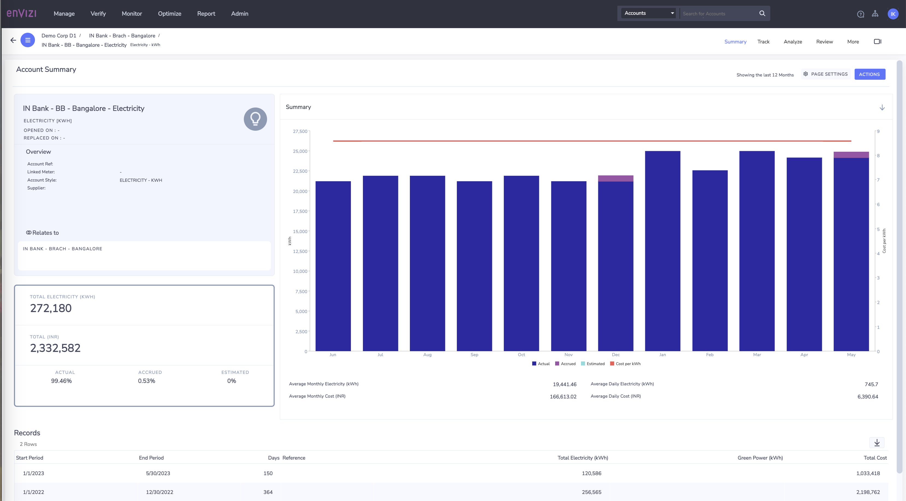

You can view the Records loaded at the bottom.  If you observe, we have loaded one record each for the year 2022 and year 2023 till May.  Envizi normalizes the data in monthly data format and provide the view as you see in the Summary page. You can also navigate to Monthly Data summary from Review -> Monthly Data for Account Summary page.

 

2. View Account performance
  *Account Summary page -> Track -> Performance*

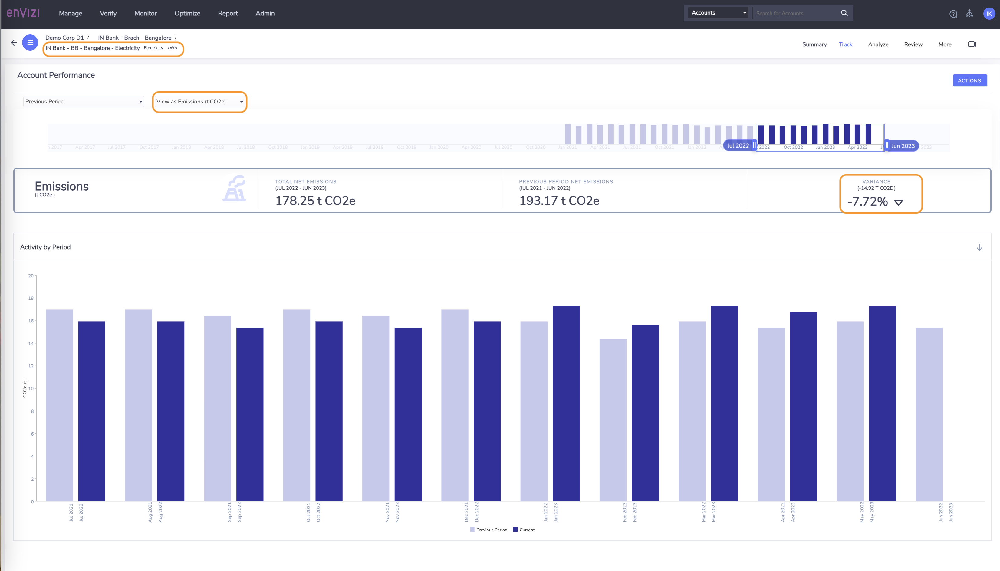
 
Looking at the above screen, we can gain insights on whether the emissions are increasing or decreasing with respect to that account.  
 

3. View Branch Performance 
   *Envizi UI -> DemoCorpD1 -> Classification Groups -> IN Bank -> IN Bank - Bank Branches -> click on any of the Branch ->  Track -> Performance*

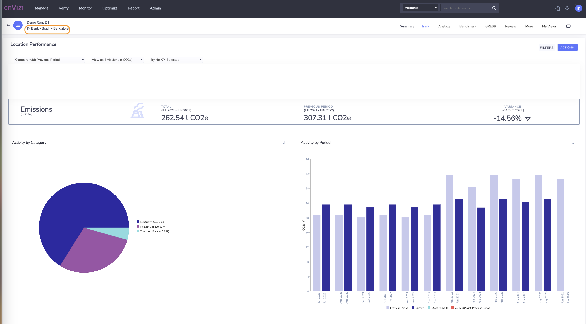

 

4. Similarly, look at the overall Bank performance.
*Envizi UI -> DemoCorpD1 -> Classification Groups -> IN Bank -> Track -> Emissions Performance*

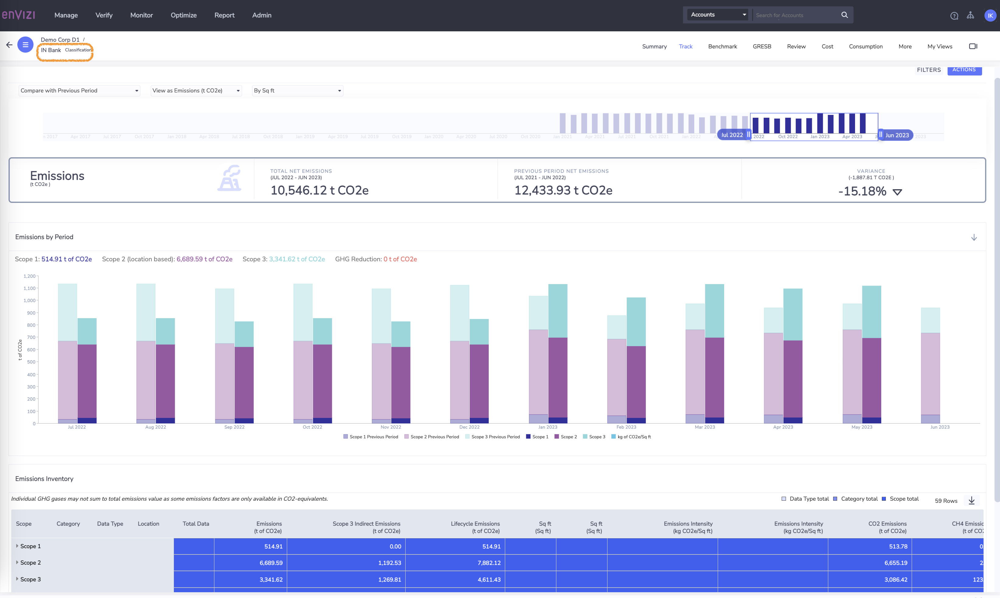

 

## Conclusion:
In this article, we have tried to provide holistic view on organization hierarchy by taking an example Bank. For this example bank, we have identified groups /subgroups / locations / data to be captured and  created all of those using the excel templates . Also loaded data into the accounts and able to view the insights by looking emission performance dashboard starting at granular level like accounts, specific branch level and at overall bank. 

